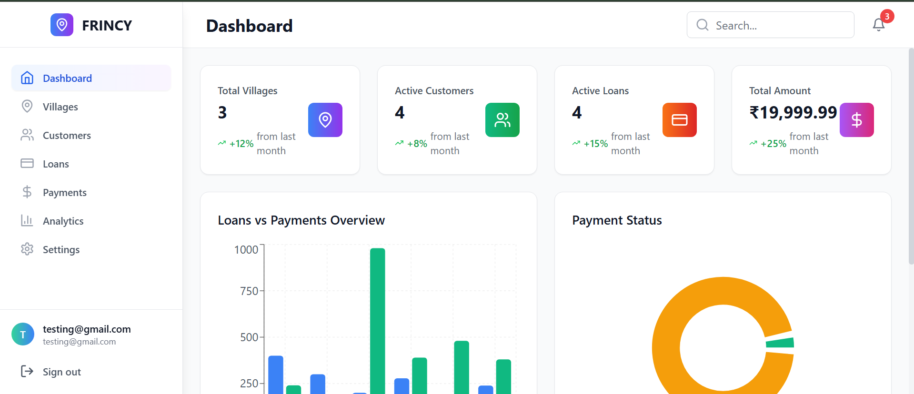
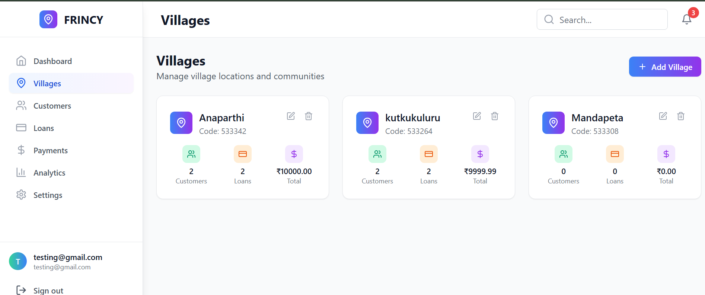
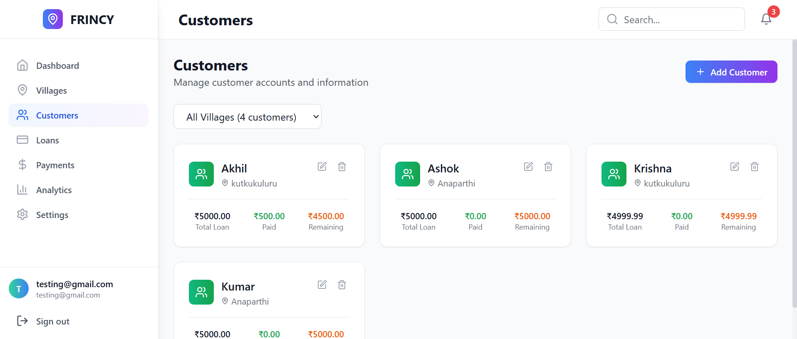
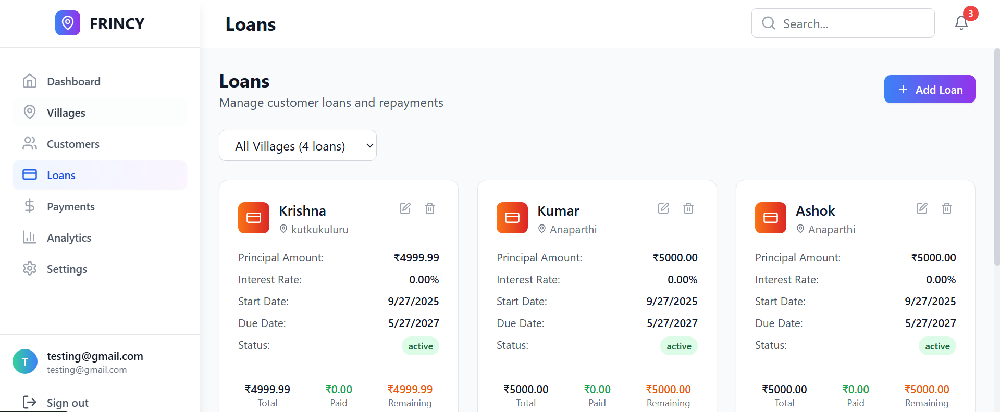
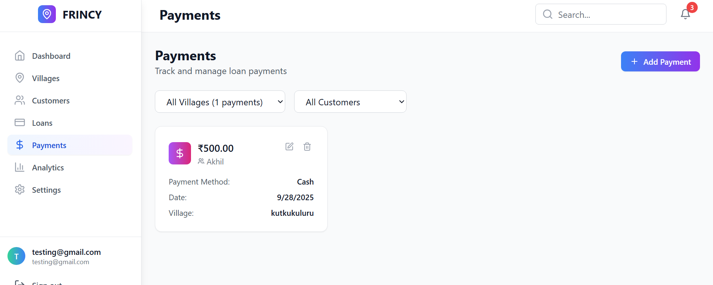
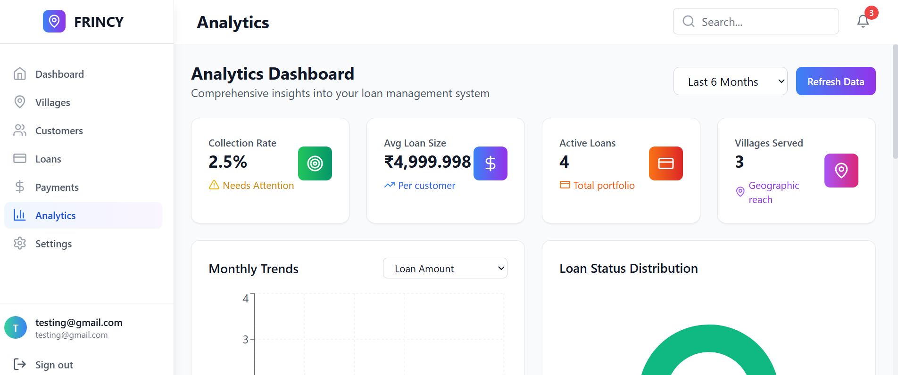

# Frincy - Loan Management Webpage 🚀 
A modern, web-based **Loan Management System** to manage customers, loans, payments, villages, and track analytics efficiently.

---

## 🌟 Features

| Feature | Description |
|---------|-------------|
| **Add Customer** | Register new customers with complete details. |
| **Add Loan** | Assign and manage loans for customers. |
| **Add Payment** | Record payments against loans and track history. |
| **Add Villages** | Maintain village information for customers. |
| **Analytics Dashboard** | Visualize payments, pending amounts, and generate insights with dynamic charts. |

---

## 💻 Technology Stack

- **Frontend:** HTML, CSS, JavaScript  
- **Backend:** Python / Node.js (your choice)  
- **Database:** SQL Server / PostgreSQL / SQLite  
- **Analytics:** Interactive charts for payment summaries and pending payments  

---

## 🎯 Usage

1. **Clone the repository**

```bash
git clone https://github.com/ySureshReddy36/frincy.git

```
## Images
## Dashboard Preview


## Villages Form

## Add Customer Page


## Loans Page


## payments Page


## Analytics Page


